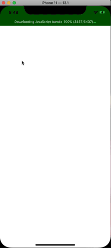

# Image Date URI breaking

Demo of breaking data image uri 

```
<Image
    source={{uri: 'data:image/gif;base64,R0lGODdhZABkA...'}}
    style={{backgroundColor: 'grey', width: 100, height: 100}}
/>
```

